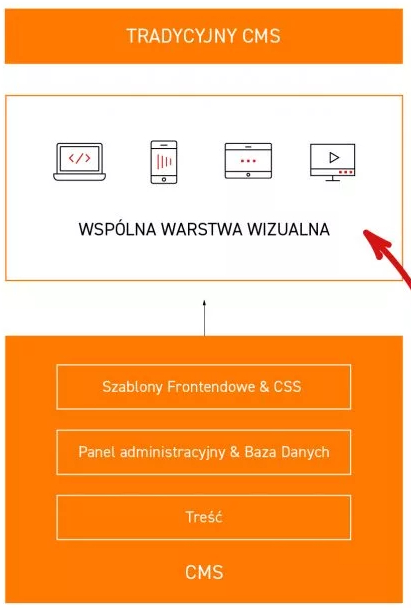
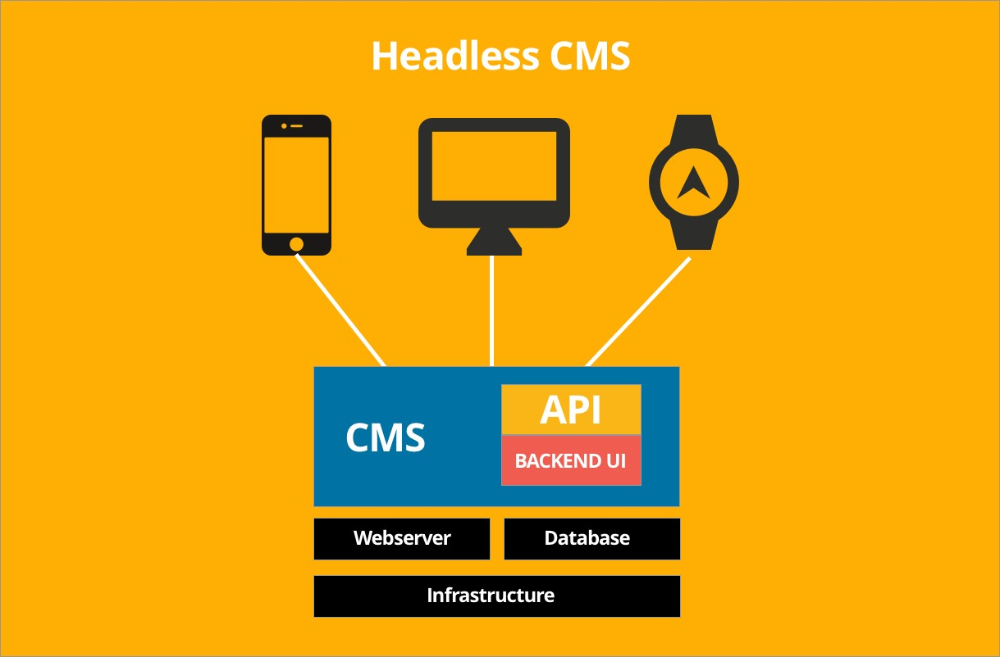
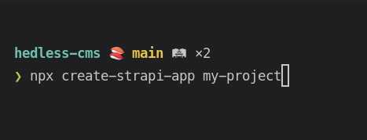
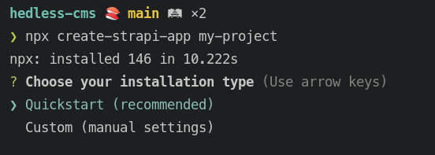
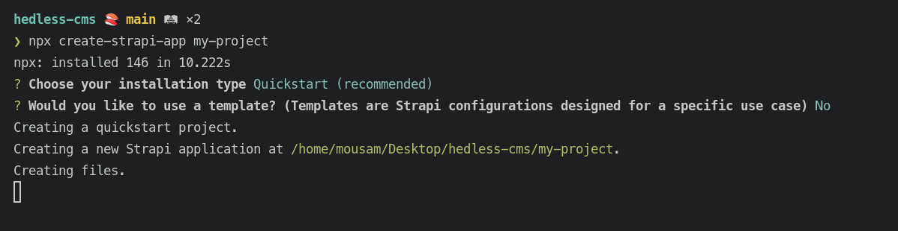
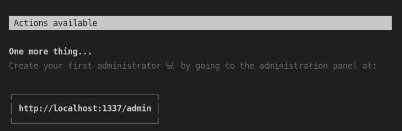

# **Headless CMS**

**CMS (Content Management System)**

Software that helps users create, manage, and modify content on a website.

Two parts :

- Content Management Application (CMA) - Frontend
- Content Delivery Application (CDA) - Backend

Benifits :

- Greater consistency and accuracy.
- Reduced maintenance costs.
- Reduced delivery costs.

Usage :

- Static Websites
- Blogs
- eCommerce Stores
- Portfolios

**Headless CMS**

Headless CMS architecture separates back-end content functions (like creation, management, and storage) from front-end functions (like presentation and delivery).

**Strapi CMS**

- Strapi is the leading open-source headless CMS. It’s 100% JavaScript, fully customizable and developer-first. (https://strapi.io/)

- NodeJS and npm --> required

- `npx create-strapi-app my-project`

- Steps 1 -

  

  - Step 2 -

- Step 3 -

  

- Step 4 -

  

